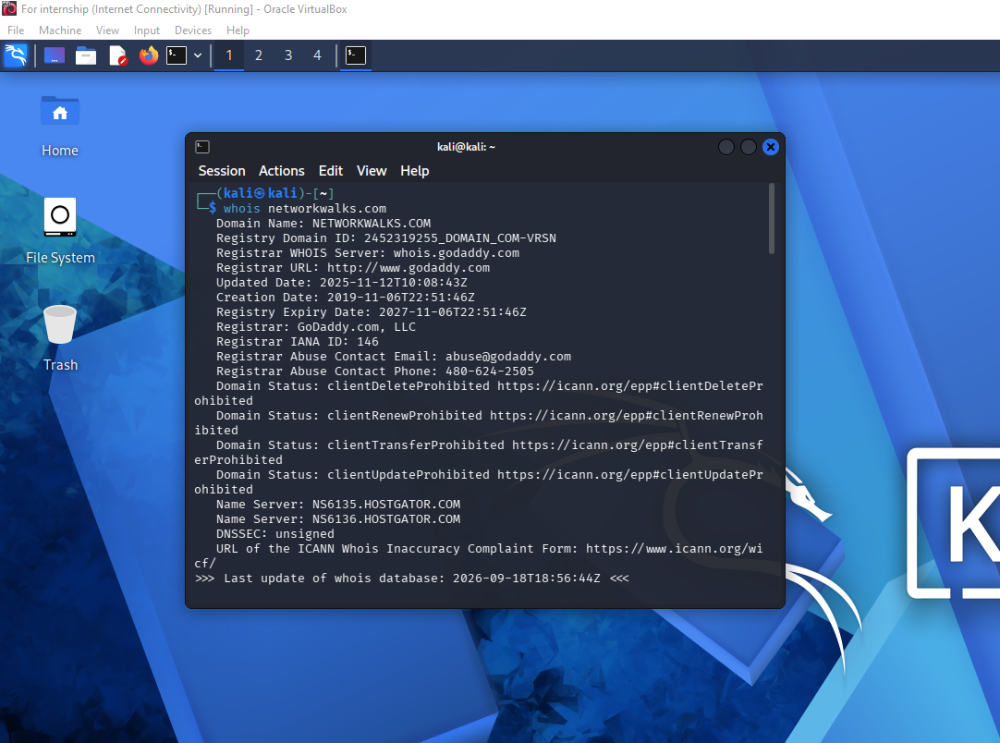
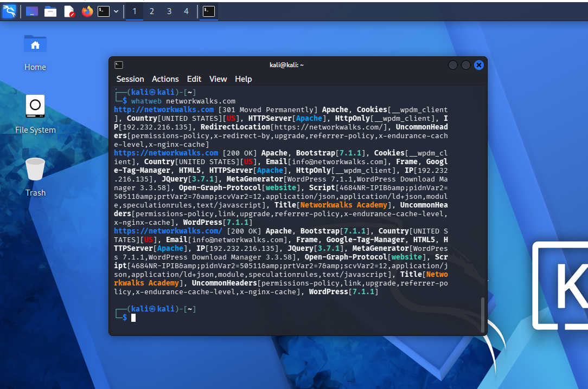
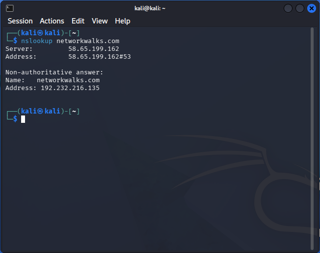
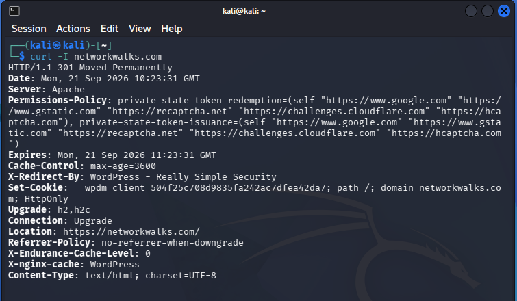
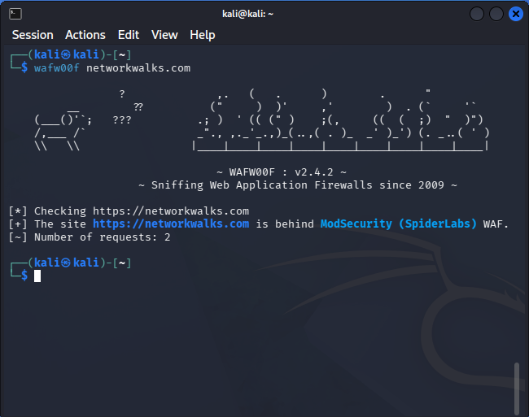
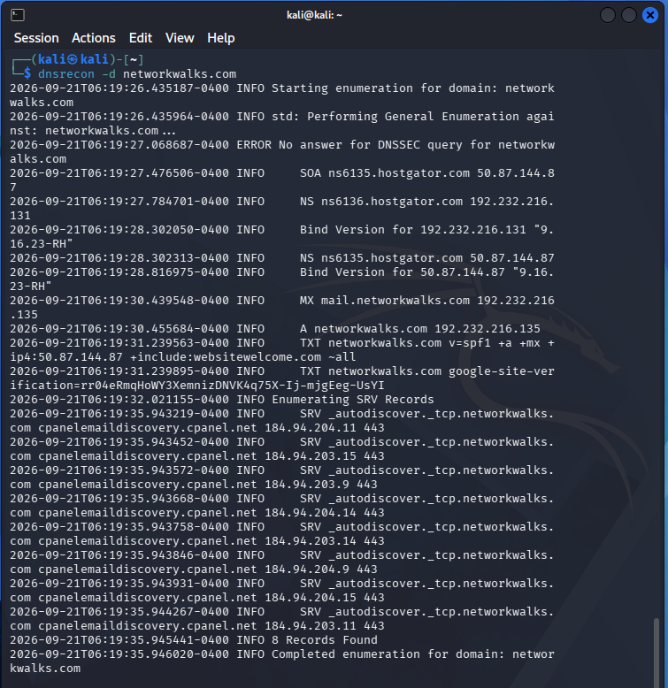

# 🔍 Cybersecurity Footprinting & Reconnaissance Lab

**Performing authorized reconnaissance and information gathering on a target domain using Kali Linux tools**

---

## 📌 Project Overview

This project documents a **footprinting and reconnaissance lab** performed using Kali Linux tools against an authorized target domain, `networkwalks.com`.

The goal is to understand how security professionals gather publicly available information about a target before any further security assessment — without attempting to access, exploit, or damage the target in any way.

> ⚠️ **Important:** All activities in this lab were performed against an authorized target as part of a training exercise. Never run reconnaissance or scanning tools against systems you don't own or have explicit permission to test.

---

## 🎯 Objectives

- Perform a WHOIS lookup to gather domain registration information.
- Fingerprint the target website's technologies using WhatWeb.
- Resolve the domain's IP address using Nslookup.
- Inspect HTTP response headers using cURL.
- Detect the presence of a Web Application Firewall (WAF) using Wafw00f.
- Enumerate DNS records using DNSRecon.
- Document all findings, tools, and results.

---

## 🛡️ Purpose of the Lab

This lab is part of a structured penetration-testing methodology and represents the **reconnaissance phase**, which focuses on:

- Domain and ownership information gathering
- Web technology fingerprinting
- DNS enumeration
- HTTP header analysis
- WAF/security control detection

---

## ⚙️ Lab Configuration

| Component          | Configuration              |
|--------------------|-----------------------------|
| 🖥️ Host OS          | Windows 11                  |
| 🐉 Attacker Machine | Kali Linux 2026.2           |
| 🎯 Target           | networkwalks.com            |
| 🌐 Target IP        | 192.232.216.135              |
| 🧰 Tools Used       | whois, whatweb, nslookup, curl, wafw00f, dnsrecon |

---

# Reconnaissance Procedure

## Step 1. WHOIS Lookup

Used `whois` to collect publicly available domain registration and ownership-related information.

**WHOIS Result:**

**Findings:**
- Domain registered with **GoDaddy.com, LLC**, created on **6 Nov 2019**, expiring **6 Nov 2027**.
- Registrant identity is hidden via **WHOIS privacy** (Domains By Proxy, LLC).
- Name servers point to **HostGator** (`ns6135` / `ns6136.hostgator.com`).
- Domain has transfer/update/renew/delete locks enabled, protecting it from unauthorized changes.

---

## Step 2. WhatWeb — Technology Fingerprinting

Used `whatweb` to identify technologies and components detected on the target website.

**WhatWeb Result:**

**Findings:**
- Site runs on **WordPress 7.1.1** with the **WordPress Download Manager** plugin.
- Hosted on **Apache**, IP `192.232.216.135` (United States).
- Uses **Bootstrap 7.1.1**, **jQuery 3.7.1**, and **Google Tag Manager**.
- HTTP requests redirect (301) to HTTPS, confirming HTTPS is enforced.
- A public contact email (`info@networkwalks.com`) was exposed in page metadata.

---

## Step 3. Nslookup — DNS Resolution

Used `nslookup` to resolve the domain name and identify its associated IP address.

**Nslookup Result:**

**Findings:**
- Domain resolves to a single **A record**: `192.232.216.135`, matching the IP seen in the WhatWeb scan.
- Response was a **non-authoritative answer**, returned from a resolving DNS server.

---

## Step 4. cURL — HTTP Header Inspection

Used `curl -I` to inspect the HTTP response headers returned by the target.

**cURL Result:**

**Findings:**
- Server responds with **301 Moved Permanently**, redirecting to `https://networkwalks.com/`.
- Header `X-Redirect-By: WordPress - Really Simple Security` reveals the plugin enforcing the HTTPS redirect.
- Security headers present: `Permissions-Policy`, `Referrer-Policy`.
- No `Strict-Transport-Security` (HSTS) header was observed.

---

## Step 5. Wafw00f — WAF Detection

Used `wafw00f` to determine whether a Web Application Firewall (WAF) was present in front of the target website.

**Wafw00f Result:**

**Findings:**
- Target is protected by **ModSecurity (SpiderLabs) WAF**.
- Detected in just 2 requests, confirming an active and identifiable WAF signature.

---

## Step 6. DNSRecon — DNS Enumeration

Used `dnsrecon` to enumerate DNS records associated with the target domain.

**DNSRecon Result:**

**Findings:**
- Confirmed **SOA** and **NS** records on HostGator servers running BIND 9.16.23-RH.
- Found an **MX record** (`mail.networkwalks.com`) pointing to the same hosting IP.
- **TXT records** include an **SPF record** and a **Google Site Verification** token.
- 8 **SRV records** for `_autodiscover._tcp` confirm mail is managed through **cPanel/WHM**.
- No DNSSEC records found, consistent with the "unsigned" result from WHOIS.

---

# 📊 Summary of Key Findings

| Category | Finding |
|----------|---------|
| Hosting | HostGator (shared hosting), IP `192.232.216.135` |
| CMS | WordPress 7.1.1 + WordPress Download Manager |
| Security | Protected by ModSecurity WAF; HTTPS enforced via "Really Simple Security" plugin |
| Email Infra | cPanel-managed mail with MX + SPF records |
| Privacy | WHOIS details hidden via Domains By Proxy |
| DNS | Unsigned (no DNSSEC); standard SOA/NS/MX/TXT/SRV records present |

---

# 💡 What I Learned

### 1. Passive vs Active Reconnaissance
WHOIS, Nslookup, and DNSRecon are passive/semi-passive techniques that gather information without directly interacting with the target's application layer, while WhatWeb and cURL involve direct HTTP requests.

### 2. Technology Fingerprinting
Learned how identifying a CMS, plugin versions, and frameworks helps build a picture of a target's attack surface — even though a version alone doesn't confirm a vulnerability.

### 3. WAF Detection
Learned that detecting a WAF early in an assessment helps a tester understand what defenses are in place before further testing.

### 4. DNS Enumeration
Learned how SOA, NS, MX, TXT, and SRV records reveal infrastructure details like mail hosting and domain verification setups.

### 5. Documentation
Documenting each tool, command, and finding clearly is a core part of professional reconnaissance reporting.

---

# 🔐 Security & Ethical Use

This lab is intended strictly for educational and authorized testing purposes only. All reconnaissance activities were performed against an authorized target with permission, without attempting to exploit or damage the target.

---

# 🔗 Tools & Resources

- **Kali Linux:** https://kali.org/get-kali
- **WhatWeb:** https://github.com/urbanadventurer/WhatWeb
- **Wafw00f:** https://github.com/EnableSecurity/wafw00f
- **DNSRecon:** https://github.com/darkoperator/dnsrecon

---

# 👤 Author

**Bilal Ashfaq**

`Computer Science Student | Cybersecurity & Networking Enthusiast`

LinkedIn: https://www.linkedin.com/in/bilal-siddiqui-61562a333/
